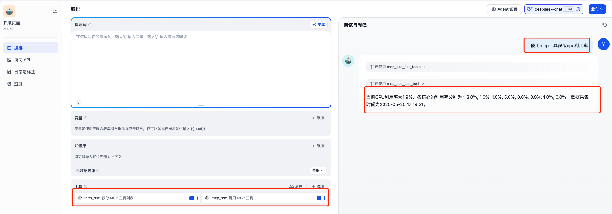
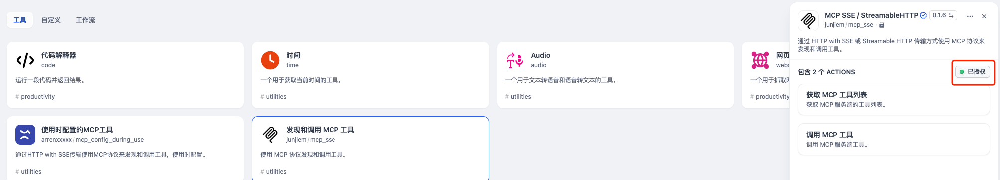
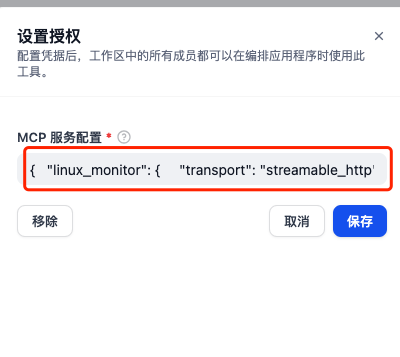

# mcp-server-demo

## Overview
为了测试验证Dify的MCP功能，Dify上使用MCP SSE/StreamableHTTP插件，需要一个mcp server来对接验证。本项目采用streamable_http传输模式构建的的mcp-server示例，实现了查询linux服务器cpu利用的简单功能。
最终效果如下图所示


## Get Started
如何安装MCP SSE/StreamableHTTP插件，这里不赘述

### 下载代码
```
git clone https://github.com/hchyue/mcp-server-demo.git
cd mcp-server-demo
```

### 运行环境
```
# Create a virtual environment and install dependencies
# 如何没有安装uv，可以执行下面这个命令，如果已经安装，可以跳过

# macOS
pip3 install uv --break-system-packages

# Linux(ubuntu)
pip3 install uv --break-system-packages

```

### 执行
```
# We support using Python 3.10, 3.11, 3.12
uv venv .mcpvenv --python=3.10

# Activate the virtual environment
# For macOS/Linux
source .mcpvenv/bin/activate

uv pip install psutil Flask
python mcp-server.py
```

### MCP SSE/StreamableHTTP插件的授权配置

找到MCP SSE/StreamableHTTP插件的授权配置入口


填写如下的json，注意x.x.x.x是mcp-server.py所运行的server IP
```
{
    "linux_monitor": {
        "transport": "streamable_http",
        "url": "http://x.x.x.x:5000/mcp",
        "headers": {
            "X-Mcp-Protocol": "streamable_http",
            "X-Mcp-Version": "1.0",
            "Content-Type": "application/json"
        },
        "timeout": 30,
        "provider_name": "linux_monitor"
    }
}
```


### 验证
创建一个agent，增加“mcp_sse 获取MCP工具列表”和“mcp_sse 调用MCP工具”两个工具，然后输入“使用mcp工具获取cpu利用率”
